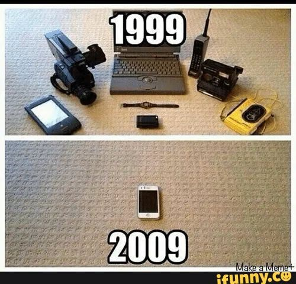

## The Stories We Tell ~~that cave us in or set us free?~~

**First,** fire creates a shadow dance across cave drawings  
Like a dream materializes endless forms: plays, radio, telephones _and more_  

  

_Same stories across multimedia_  
Casting different shadows in the caverns of the mind  
**Now,** computer power mesmerizes us all  

 

### Youtube link to a video that compliments this poem:  
https://www.youtube.com/watch?v=1RWOpQXTltA
